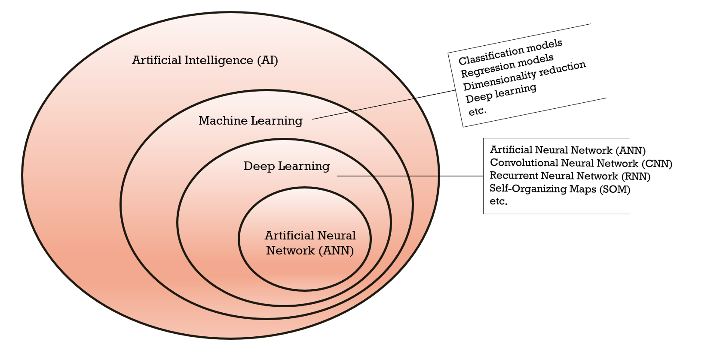
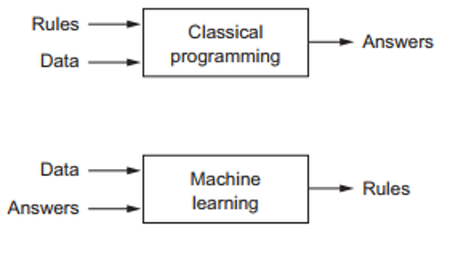

# A little about Machine Learning and Deep Learning
 First, we need to understand the relationship between artificial intelligence (AI), machine learning, deep learning, and artificial neural networks (ANN). The picture below shows their relationship. Many people still don't know this connection. 
 
 
 
 In traditional programming, we enter some rules (programs) and then input some data that will be processed according to these rules to generate answers. However, in machine learning model, we feed the input data and the answers associated with that data into the model to generate rules between the input data and the answers. You can apply these rules to a new input data to get an answer to that input data. 
 
 
 
 futhermore we can categorize machine learning models into 2 categories, namely supervised and unsupervised learning. Few differences:
- Supervised learning models need labeled dataset (answers) while unsupervised learning models do not.
- Supervised learning models learn from training dataset while unsupervised learning models learn on its own
- Supervised learning is mainly used for classification and regression, while unsupervised is used for dimensionality reduction and clustering.

### Source(s): 
1. Chollet, F. (2018): Deep learning with Python, Manning Publication